**SINOPSIS**

Jocurile de strategie actuale abstractizează forțele militare în unități numerice, eliminând potențialul pentru narațiuni personale și logistică militară realistă. Acest proiect constă în dezvoltarea unui joc de strategie tactică în timp real, care modelează informațional armate medievale, urmărind starea fizică, psihologică și istoricul de bătălii al fiecărui soldat în parte. Implementarea utilizează o organizare ierarhică a armatei, în care armatele conțin unități care la rândul lor conțin soldați individuali, fiecare dintre aceștia posedând aproximativ 50 de atribute incluzând sănătatea, oboseala, foamea, moralul și istoricul personal. Sistemul integrează managementul logistic cu mișcarea pe grila hexagonală și luptele tactice bazate pe faze. Distribuirea hranei prioritizează trupele de elită în timpul penuriei, viteza de mișcare depinde de condițiile soldaților individuali, iar rezultatele bătăliilor reflectă oboseala și moralul acumulate de către forțele participante. Testarea performanței cu armate de 100-150 de soldați a menținut 60 de cadre pe secundă pe hardware standard. Evaluarea utilizatorilor a dezvăluit o recepție pozitivă a sistemelor de gestionare a armatei, dar a identificat nevoi pentru sisteme îmbunătățite de tutorial și feedback vizual. Proiectul demonstrează că simularea detaliată a soldaților individuali creează narațiuni emergente convingătoare păstrând în același timp profunzimea strategică așteptată de la jocurile de strategie militară.

**ABSTRACT**

Current strategy games abstract military forces into numerical units, eliminating the potential for personal narratives and realistic military logistics. This project consists of developing a real-time tactical strategy game that models at the information level medieval armies, tracking the physical condition, psychological state, and battle history of each soldier. The implementation utilizes a hierarchical army organization, where armies contain units which further contain individual soldiers, each of them possessing approximately 50 attributes including health, fatigue, hunger, morale, and personal history. The system integrates logistics management with hexagonal grid movement and phase-based tactical combat. Food distribution prioritizes elite troops during shortages, movement speed depends on individual soldier conditions, and battle outcomes reflect the accumulated fatigue and morale of participating forces. Performance testing with armies of 100-150 soldiers maintained 60 FPS on standard hardware. User evaluation revealed positive reception of army management systems but identified needs for improved tutorial systems and visual feedback. The project demonstrates that detailed individual soldier simulation creates compelling emergent narratives while maintaining strategic depth expected from military strategy games.
:::

# Introduction

## Context

The strategy game genre has evolved significantly over the past decades [@study1], with titles now ranging from grand strategy games that manage civilization in all its aspects to tactical games that focus on small-scale, localized battles. In this background, however, a significant gap exists: other than a small set of military simulators created specifically for armed forces use [@site1], there are few games that manage to showcase strategic complexity while maintaining meaningful detail at the individual soldier level.

Modern strategy games typically abstract military forces into numerical units, oversimplifying intricate human interactions into basic metrics. This abstraction, while necessary for computational efficiency [@study2] and gameplay clarity, sacrifices the rich narratives that could arise from tracking individual warriors through their military service [@site8].

Crusader Kings 3 simulates individual nobles with complex personality traits, relationships, and life events that create compelling narratives. Each character possesses detailed attributes affecting their behavior, from genetic traits to learned skills. However, the armies these characters command exist only as numbers - \"1000 levies\" or \"200 men-at-arms\" - with no individual identity or persistent history.

Mount and Blade II: Bannerlord attempts to have a greater level of detail by naming the closest elite companions of the player and tracking some individual progression but this is strictly limited to a reduced number of NPCs that the player recruits, and does not account for the troops that make up the majority of the player armies.

The Total War series provides highly detailed battlefield visualization with thousands of animated soldiers, but these representations lack persistence between battles. A unit of \"Veteran Spearmen\" that suffers 90% casualties replenishes to full strength with anonymous replacements and no further gameplay consequences [@site6] [@site7].

The concept of emergent storytelling in games has gained significant traction [@site2] [@site5], with titles like Dwarf Fortress and RimWorld demonstrating the compelling nature of procedurally generated personal narratives [@study3]. However, these games typically focus on colony management or small group dynamics. The military strategy genre has yet to fully embrace this detailed approach to storytelling, particularly in medieval combat scenarios where personal expertise was vital and one pivotal instant could transform the outcome of an entire war.

## Problem

Current strategy games face a fundamental limitation in their representation of military forces: they are unable to simulate the human element of warfare at scale in a meaningful way. Several issues thus appear:

- By abstracting armies into homogeneous units of soldiers, the potential for personal narratives to emerge from gameplay is reduced [@study4] [@site3]. When a unit of "48 crossbowmen" loses half its strength in a battle, this loss is only something to consider when planning the next strategy, not a loss of individual soldiers with names, experiences and stories. This abstraction reduces emotional investment and eliminates opportunities for organic storytelling.

- Existing games poorly represent the complex logistics and morale systems that have historically determined military success [@study8] [@book1] [@book3] [@book5]. Factors such as individual soldier fatigue, personal food distribution, troop relationships, and the cascading effects of individual deaths on unit morale [@book2] are either completely ignored or heavily simplified. This oversimplification leads to unrealistic military behaviors and outcomes.

- The disconnect between strategic army movement and tactical battle resolution in current games creates an artificial separation that ignores fundamental human limitations. Real armies do not move at constant speeds indefinitely---they consist of individual soldiers who cannot march for days without rest [@book3], who slow down when hungry or wounded, whose pace deteriorates as fatigue sets in, and whose willingness to continue depends heavily on morale [@study6] [@study7]. Individual soldier performance, shaped by their hunger, fatigue, wounds, and morale, directly impacts both movement capabilities and battle effectiveness, creating a need for a unified simulation where the human cost of military campaigns is represented as authentically as possible and every aspect of a soldier's condition matters.

## Obtained Results

The implementation successfully tracks individual soldiers through multiple battles, creating persistent narratives as veterans develop combat experience and rookies either survive to gain ranks or die in combat. The logistics system creates meaningful strategic decisions where food shortages affect specific named individuals rather than abstract unit strength. Combat outcomes depend on the accumulated fatigue, hunger, and morale of individual soldiers, adding another layer to strategic planning. Performance testing with armies of 100-150 soldiers maintained 60 FPS on standard consumer hardware. User testing revealed significant usability gaps: 50% of players rarely accessed individual soldier information, battle interface intuitiveness received an average rating of 3.38 on a 5-point scale, and multiple participants reported confusion with the game controls and systems. These findings indicate the need for a comprehensive tutorial system and improved visual feedback mechanisms.

## Paper Structure

Chapter 2 analyzes requirements and motivation, defining functional and non-functional specifications for individual soldier simulation systems.

Chapter 3 examines existing strategy games including Crusader Kings 3, Mount & Blade II: Bannerlord, RimWorld, and Dwarf Fortress, identifying their approaches to character simulation and military representation limitations.

Chapter 4 presents the proposed real-time tactical strategy game solution with a hierarchical army organization and integrated combat systems.

Chapter 5 details the implementation including time management, hexagonal grid pathfinding, soldier attribute tracking, logistics management, battle resolution, and event systems built in Unity.

Chapter 6 evaluates functional requirements validation, analyzes user feedback from eight testers, and identifies technical issues including interface confusion and missing tutorial systems.

# Requirement Analysis and Motivation

## Motivation

Contemporary strategy games exhibit a fundamental asymmetry in their simulation depth: while player characters and political systems receive increasingly sophisticated modeling, military forces remain abstracted as statistical aggregates. This disparity becomes particularly evident in titles that otherwise excel at storytelling through detailed character simulation [@study5].

The gap this project addresses is the absence of persistent, individual soldier simulation in strategy games with military focus. By treating each soldier as a discrete entity with trackable attributes, experiences, and fate, the project aims to create emergent narratives at the tactical level that match the strategic depth these games achieve elsewhere [@study4]. When a battle is won, it matters which specific soldiers survived to become veterans. When supplies run low, distribution choices affect named individuals, not abstract numbers. This approach tries to transform military forces from renewable resources into collections of unique individuals whose survival becomes intrinsically meaningful to gameplay [@study3].

## Objectives

The primary objective of this project is to develop a functional game prototype that demonstrates that extreme detail in soldier simulation can create compelling emergent narratives while maintaining the strategic depth expected from military strategy games. Specific objectives include:

- Implementing a comprehensive individual soldier simulation system where each warrior possesses unique attributes including name, personality traits, combat skills, physical condition (health, fatigue, hunger), psychological state (morale, battle experience), and personal history (battles survived, enemies killed, wounds sustained).

- Developing realistic military logistics where food distribution, march routes, and rest periods create meaningful strategic decisions with cascading consequences at the individual soldier level, accurately reflecting medieval military challenges.

- Creating an integrated battle system where individual soldier conditions directly influence combat performance, producing realistic battle dynamics where hungry, exhausted troops perform poorly regardless of numerical superiority.

- Establishing systems that generate emergent narratives through the natural interaction of game mechanics, allowing stories to arise from the survival of individual soldiers through multiple battles, the development of veteran units, and the losses of promising warriors.

- Demonstrating technical feasibility by maintaining acceptable performance while modeling the data of hundreds of individual soldiers simultaneously, proving that such a detailed level of information about characters is viable for commercial game development.

- Validating the gameplay concept by creating engaging strategic challenges where player success depends on managing the human element of their forces rather than simply massing numerical superiority.

## Functional Requirements

Based on the analysis of the limitations identified in existing games and on the project objectives, the following functional requirements were defined:

- FR1: Individual Soldier Information Modeling System

  - Each soldier must possess unique attributes: procedurally generated name, personality traits, differentiated combat skills, quantifiable physical condition (health, fatigue, hunger)

  - The system must record the personal history of each soldier: battles they participated in, enemies defeated, wounds suffered

  - Soldiers must have an experience system with ranks (0-5) that affect combat effectiveness

- FR2: Realistic Logistic Management

  - The game must implement a food distribution system based on supply levels (reduced, normal, additional rations)

  - The game must calculate daily food consumption based on the type of troops and the supply level

  - The game must prioritize food distribution to elite troops in case of shortages

- FR3: Movement and Fatigue System

  - The game must implement movement states (stationary, marching) with impact on troop fatigue

  - The game must calculate movement speed based on average fatigue, wounds and horse equipment

  - The game must limit movement capacity when fatigue exceeds critical thresholds (90%)

- FR4: Integrated Combat System

  - The game must implement differentiated combat tactics for infantry, cavalry and long-range troops

  - The game must calculate combat performance based on individual soldier status (fatigue, hunger, morale, wounds)

  - The game must have a combat phase system with tactical exchanges and the possibility of retreat

- FR5: Emergent Narrative Generation

  - The game must record and display individual soldier stories

  - The game must have a promotion system based on experience and combat performance

  - The player must have the possibility of tracking veterans through multiple campaigns

## Non-functional Requirements

Based on the project objectives and the previously described functional requirements, the following non-functional requirements defined:

- NFR1: Performance

  - The game must maintain a minimum of 60 FPS when simulating up to 500 individual soldiers

  - When a player selects a tactic the response time for tactical commands should not exceed 100ms

  - Simulation calculations for a game day should not take more than 2 seconds

- NFR2: Scalability

  - The architecture should allow expansion to armies of up to 1000 soldiers without fundamental changes

  - The system should support the addition of new troop types without major refactoring

  - The game mechanics should work consistently for armies of 50-500 soldiers

- NFR3: Usability

  - The interface should allow accessing information about individual soldiers with a maximum of 2 clicks

  - The general state of the army (hunger, fatigue, morale) should be permanently visible in the interface

  - The tactics system should be intuitive, with clear descriptions of the effects of each tactic

- NFR4: Maintainability

  - The code should be structured modularly, with a clear separation between the simulation logic and the interface

  - The system must include detailed logging for debugging and analysis

- NFR5: Compatibility

  - The game must run on Windows 10

  - The game must support a resolution of 1920x1080

  - The game must support standard controls for strategy games (mouse + keyboard)

# Market Research and Similar Solutions {#chap:SimilarSolutions}

In this chapter, several existing strategy games that incorporate elements relevant to individual soldier simulation and emergent narrative generation are examined. The analysis focuses on games that have achieved notable success in character-driven gameplay, military strategy, or detailed individual simulation, identifying both their achievements and limitations in representing military forces at the individual level.

The selected games represent different approaches to the problem of creating meaningful narratives within strategy gameplay. Crusader Kings 3 demonstrates the potential of detailed character simulation in grand strategy contexts. Mount & Blade II: Bannerlord expands player immersion by involving them in the growth and expansion of their army. RimWorld and Dwarf Fortress, though operating at smaller scales, provide valuable insights into how tracking individual colonists or dwarves creates compelling emergent stories through the interaction of complex systems.

## Crusader Kings 3

Crusader Kings 3, as well as its predecessors, represents one of the best examples of character-driven strategy gaming, as the player must handle every aspect of medieval politics, which in the historical time period the game is set, revolved mostly around individual personalities instead of the polities they ruled. The game simulates thousands of named characters across Europe, Africa and Asia, each possessing detailed attributes including personality traits, skills, genetic characteristics, and complex relationship webs. Characters develop throughout their lifetimes, acquiring new traits based on their experiences, forming friendships and rivalries, and creating emergent narratives through their interactions [@study5]. The game tracks individual relationships with remarkable precision, remembering past slights, favors, and shared experiences that influence diplomatic interactions.

The personality system operates on multiple layers. Base traits like \"Gregarious\" or \"Shy\" affect how characters interact socially, while lifestyle traits acquired through player choices or random events shape their capabilities and worldview. A character pursuing the \"Intrigue\" lifestyle might develop traits like \"Schemer\" or \"Torturer,\" fundamentally altering how they approach problems and how other characters perceive them. Physical traits ranging from \"Beautiful\" to \"Disfigured\" affect diplomatic interactions, while mental traits like \"Genius\" or \"Imbecile\" influence their effectiveness in various roles \[[3.1](#fig:pic1){reference-type="ref" reference="fig:pic1"}\].

The stress and mental health system adds another layer of individual character simulation. Characters accumulate stress from various sources - difficult decisions, trait conflicts, traumatic events, or simply the burden of rulership. High stress leads to mental breaks that can fundamentally alter a character's personality, sometimes in positive ways (gaining traits like \"Calm\" after overcoming anxiety) but often negatively (developing addictions, becoming cruel, or suffering complete mental collapse). This system creates ongoing character development throughout a character's lifetime, ensuring that rulers change and evolve based on their experiences.

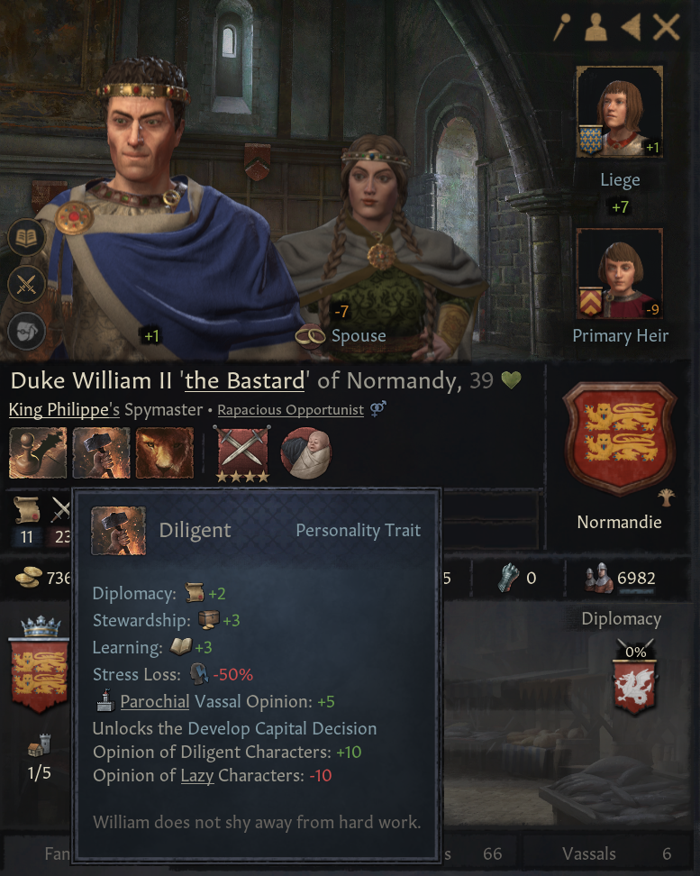{#fig:pic1 width="60%"}

With characters controlled by the game AI, all of these factors compound into a multitude of different personality types which influence the decisions these characters take. For example, Boldness determines how much the character is affected by Dread (the game's representation of fear of reprisal) and Vengefulness determines how much the character will punish transgressions. This means that while a craven, vengeful character might not openly rebel out of fear of being punished, they will consider and most certainly join secret plots against the player character if they somehow offended him, by revoking a title or court position. This system also extends to the player character's family and is even amplified by the personal ambitions of each character. The player's main constraint to continuing the game is having a direct successor available at all times: dying without an available heir is the only way to lose the game (After the release of one of the latest expansions at the time of writing, losing all of your feudal fiefs, which previously would have also meant "game over", now turns the player character into a landless noble which must continue its path by taking in mercenary work). While this may not seem as grave an issue, having too few heirs means putting your bloodline in danger while having too many, in the long term, almost certainly creates succession problems with distant relatives who now covet your lands.

Military campaigns in Crusader Kings 3 involve raising levies and professional troops \[[3.2](#fig:pic2){reference-type="ref" reference="fig:pic2"}\], managing supply levels, and coordinating with allies.

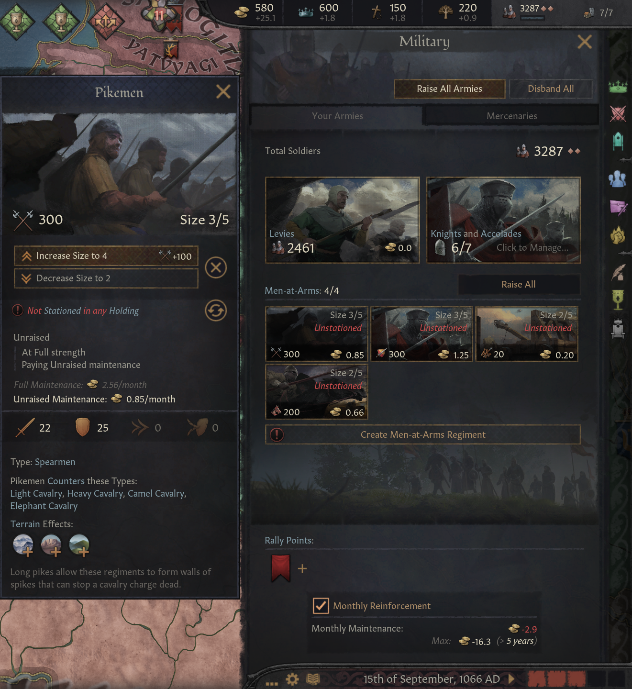{#fig:pic2 width="60%"}

The strategic layer includes considerations of terrain, weather, and the political ramifications of military actions. On a tactical level, combat resolution involves multiple phases of engagement, with army composition, commander abilities, and terrain playing important roles in the outcome of the battle \[[3.3](#fig:pic3){reference-type="ref" reference="fig:pic3"}\]. The system models different types of military tactics - heavy cavalry charges, infantry formations, archer volleys - each with advantages and disadvantages depending on circumstances. Commander traits and skills significantly impact battle outcomes, as a \"Brilliant Strategist\" can overcome numerical disadvantages through superior tactics. This is also the extent of the depth of military strategy: players have no agency in what tactics a commander chooses during combat, and in cases of similar odds, a dice roll is the final differentiator between two otherwise equal armies.

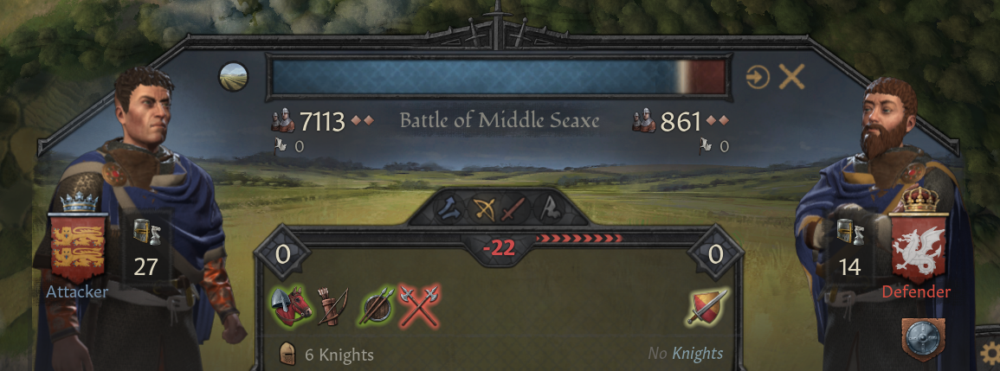{#fig:pic3 width="60%"}

When considering all of these elements of the simulation, three layers of story telling are formed: the outer ring consisting of the grand strategy elements consisting of the economy, diplomacy, military and other more "classical" strategy game areas, the middle, consisting of the character interactions of the game world, and the inner circle of familial interactions. Not by themselves, but together, these elements form most of the game's storytelling and immersion [@study5].

### Limitations in Military Simulation

The contrast between character depth and military abstraction creates a jarring disconnect. While the game meticulously tracks whether a duke has a rivalry with his brother or suffers from stress due to court intrigue, it treats the thousands of soldiers under his command as expendable numbers. When an army suffers thousands of casualties in a disastrous battle, those losses represent no individual stories, no veteran soldiers with families, no young recruits who will never return home. The human cost of warfare is reduced to a logistical calculation about replenishment costs and time. Furthermore, the game's military logistics are oversimplified compared to its political complexity. Armies can march indefinitely without rest, soldiers never desert due to poor conditions, and supply management involves only basic attrition calculations. The sophisticated relationship systems that govern noble behavior have no equivalent for common soldiers, who remain faceless and interchangeable throughout their service.

## Mount & Blade II: Bannerlord

Mount and Blade II: Bannerlord offers a unique perspective on medieval warfare by placing the player directly in the action as a warrior-leader who can personally participate in battles. The sandbox game mode begins with the player as a lone adventurer and follows their rise through the ranks of medieval society, giving him the option to take several "career" paths during the campaign: from a rich trader owning several caravans and workshops to a gang leader fighting against other gangs for control of key city districts, from mercenary captain to potential ruler of kingdoms. This personal progression creates strong player investment in their character's development and fate.

Combat in Bannerlord is highly detailed, with realistic, physics-based melee and ranged combat. Individual soldiers have specific sets of equipment, training levels, and upgrade paths. The player can recruit peasants and train them through multiple tiers to become experienced warriors, with each upgrade requiring time, money, and experience. This creates a sense of investment in troop development, as veteran units represent a significant time and resource investment \[[3.4](#fig:pic4){reference-type="ref" reference="fig:pic4"}\].

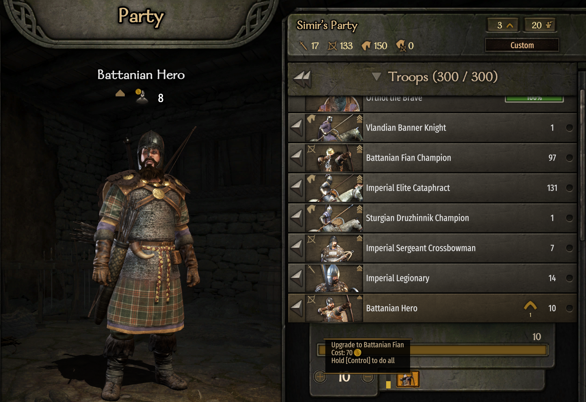{#fig:pic4 width="90%"}

The game's main way of modeling army recruitment at an individual scale adheres to the following pattern:

- The player enters a settlement, regardless of relations with the faction owning it

- If the player has enough relations with the settlements influential people, they have access to a range of recruitment slots, with higher ranking troops being locked behind an opinion threshold \[[3.5](#fig:pic5){reference-type="ref" reference="fig:pic5"}\]

- If no soldiers were previously hired from the settlements recruitment slots, the player can recruit troops that have the settlement's culture and a standardized set of equipment based on troop rank

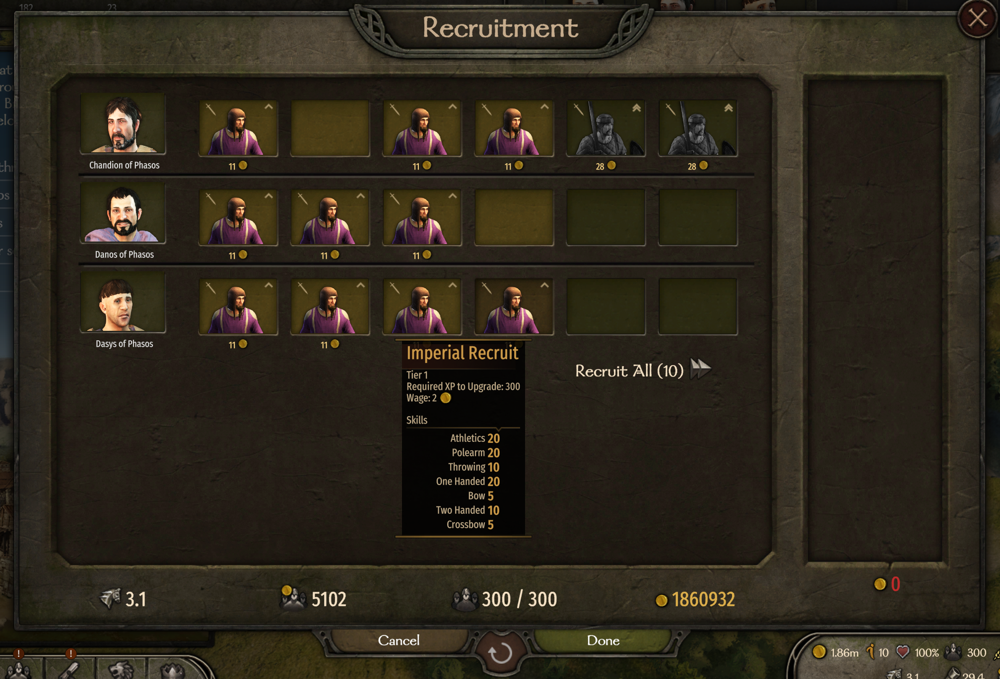{#fig:pic5 width="90%"}

This approach to army recruitment, combined with the troop investments, increases immersion in the game world initially, but after repeating this process hundreds of times during a campaign, several matters become evident. During the course of a year, hundreds of troops can be recruited from a village with no consequences to its growth, no storylines appearing from this and no change to the game world when the troop eventually dies in battle, which even with the best tactics and strategies is inevitably bound to happen, though there is no sure way to track this during gameplay.

The game features a companion system where named characters can join the player's party, each with unique backgrounds, skills, and personalities. These companions develop over time, gaining experience in various skills related to the tasks the player gives them. They can be assigned roles as governors, party leaders, or specialists, and their individual capabilities significantly impact the player's strategic options. Their background story provides insight into the skills they are proficient in but compared to the previous iteration of the game (Mount&Blade Warband), it is not used after the first time the player meets the companion in a tavern in order to recruit them. The companions' behaviour towards the player or other companions is static and their story is not used for other narrative reasons. In Warband, if the player took certain actions like raiding a village or attacking trade caravans, their companions would either approve or disprove of those actions, and if enough transgressions were to happen, they would leave the army indefinitely. Companions also had interactions between each other based on the personality traits the player learned while recruiting them.

The game includes a complex economic system that models the flow of trade from beginning to final product: raw materials are produced in villages, taken by villager parties to the closest city where they are sold to the local marketplace. From the marketplace, these materials can either be bought by local merchant NPCs to be used in the production of more refined trading goods, with a higher selling price, or bought by NPC-owned caravans to be further sold where there is a demand for that specific good. The price of the goods is dependent on both supply and demand: a northern city which doesn't have any nearby village producing olives will have a higher selling price for olives and the good they are produced into, oil, but for the same reason it will have a lower selling price for furs because of its abundancy in the region.

### Limitations in Individual Soldier Tracking

Despite its focus on personal combat, character development, commerce and having an overall fleshed out, "living", world, Bannerlord's individual soldier simulation remains limited. While the player's companions receive detailed character treatment, the bulk of military forces exist as generic troops defined primarily by their type and tier.

The game lacks persistent individual soldier narratives. When troops gain experience and upgrade to higher tiers, this progression represents abstract unit improvement rather than personal growth of specific soldiers. Veterans who survive multiple battles carry no memory of those encounters, no accumulated battle scars or psychological effects, no personal relationships with other survivors. The emotional investment that comes from tracking individuals through their military service is absent.

Additionally, the morale and logistics systems, while more sophisticated than many strategy games, still operate at the unit level rather than tracking individual soldier conditions. Hunger affects entire troop types uniformly, and desertion occurs through generic calculations rather than reflecting individual soldier decisions based on personal circumstances and experiences.

## RimWorld

RimWorld focuses on the survival and development of a small group of colonists, typically ranging from three to twenty individuals. Each colonist possesses detailed background stories, personality traits, skills, and relationships that significantly impact gameplay \[[3.6](#fig:pic6){reference-type="ref" reference="fig:pic6"}\]. The game excels at creating narratives through the interaction of individual character systems with environmental challenges and random events [@study3] [@site2].

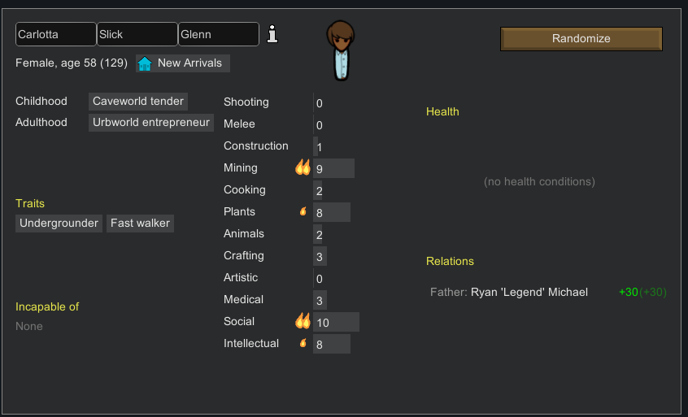{#fig:pic6 width="70%"}

The character system includes complex psychological modeling where colonists can develop mental breaks, form relationships, and change their behavior based on experiences. Individual preferences, such as favorite foods or comfort requirements, create unique challenges for the player to manage.

Combat in RimWorld is tactical and personal, with each colonist's survival carrying significant weight due to their individual value and development. The game tracks individual equipment, skills, and combat experience, with wounded colonists requiring specific medical attention and potentially suffering permanent disabilities.

The medical system is particularly complex, tracking individual injuries, diseases, and prosthetics at the body part level. This creates ongoing narratives around colonists who lose limbs in combat, develop addictions, or suffer from chronic conditions that affect their long-term effectiveness.

Military equipment and training are handled at the individual level, with each colonist's combat effectiveness determined by their personal skills, equipment quality, and psychological state. The small scale of the simulation allows for intimate tracking of each character's military development and combat history.

## Dwarf Fortress

Dwarf Fortress is one of the most extreme examples of individual character simulation out of the video games discussed in this paper [@study3]. Every dwarf in the player's fortress possesses a detailed personality profile, complete with preferences, fears, relationships, and personal history. The game tracks individual thoughts, emotions, and experiences with remarkable specificity, creating emergent narratives that arise naturally from the interaction of complex systems [@site2] [@site8]\[[3.7](#fig:pic7){reference-type="ref" reference="fig:pic7"}\].

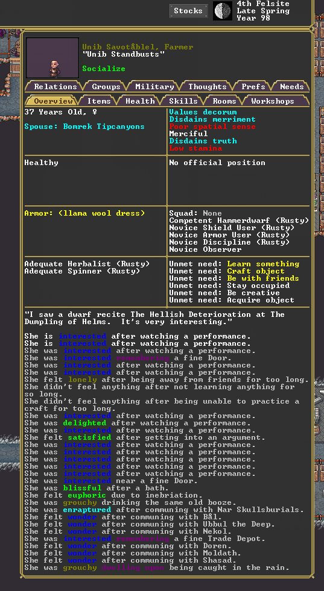{#fig:pic7 width="60%"}

Each dwarf has specific skills, attributes, and personal quirks that affect their behavior and effectiveness. The game remembers individual experiences - a dwarf who witnesses a friend's death may become depressed, while another who successfully completes a masterwork craft may gain confidence. These psychological states influence their work performance, social interactions, and decision-making.

The military system in Dwarf Fortress includes individual equipment tracking, combat experience, and personal combat histories. Soldiers can develop fears of specific creatures or gain confidence from successful battles. The game tracks individual wounds, scars, and their long-term effects on combat effectiveness.

Combat is highly detailed, with individual body parts, armor pieces, and weapons affecting the outcome of each fight. The game generates combat logs describing exactly how each battle unfolds, creating rich narratives from the mechanical interactions of the combat system.

# Proposed Solution

The proposed solution is a real-time tactical strategy game that simulates medieval armies at the individual soldier level, with inspiration taken from game design principles that emphasize meaningful player choice [@site4]. This implementation tracks each soldier as a complete entity with personal attributes, physical condition, and combat history. The armies present in the game operate on a hexagonal grid where the player commands their forces through strategic movement while managing logistics and engaging in tactical combat when armies meet.

The solution's architecture consists of several linked systems. The time management system advances the game clock in 15-minute increments with four speed settings and pause functionality. All game mechanics synchronize to this central timing system, receiving regular updates for hourly and daily processes. The hexagonal grid divides the game world into discrete cells with terrain types that affect movement costs and strategic options. Each cell connects to its neighbors, enabling pathfinding calculations and movement planning.

The army organization follows a hierarchical structure where armies contain units, which contain individual soldiers. Each soldier possesses approximately 40 attributes including health, fatigue, hunger, morale, combat statistics, and personal history. The simulation tracks physical conditions that deteriorate during marches and combat, requiring rest and supplies for recovery. Psychological factors affect performance through the morale system which is influenced by food availability, fatigue levels, health status, and battle outcomes. These individual attributes aggregate upward to determine unit and army capabilities.

Movement occurs through a pathfinding system utilizing A\* with the movement cost given by terrain attributes and the Manhattan distance used for the heuristic. Exhausted or wounded forces move slower than fresh troops, and difficult terrain multiplies these penalties. The supply system distributes food daily according to player-selected policies ranging from half rations to extra rations. Insufficient supplies trigger a priority distribution system favoring elite troops over basic infantry. Prolonged starvation causes health deterioration and eventual death or desertion.

Combat initiates when opposing armies occupy the same hex cell. The battle system extracts combat-capable soldiers from both armies, organizing them by troop type categories. Players select from tactical options that determine troop behaviors including attack intensity, defensive positioning, and retreat orders. Combat resolution processes through phases occurring every 30 game minutes, with individual soldier conditions directly affecting combat performance. Wounded, exhausted, or demoralized soldiers fight poorly regardless of numerical advantages.

The user interface provides multiple information panels for monitoring army status, individual soldier details, and battle progress. The main army panel displays aggregate statistics with color-coded warnings for critical conditions. During battles, the interface presents tactical options based on available troop types and shows real-time combat results through detailed battle logs. Time controls allow pausing and speed adjustment through both keyboard shortcuts and on-screen buttons.

Enemy armies operate through a simple system that makes movement decisions every three game hours. The enemy army manager evaluates nearby cells and selects destinations within defined territorial limits, preventing armies from wandering too far from spawn points. During combat, enemy armies select tactics based on army composition and morale levels, with low-morale armies prioritizing defensive or retreat options.

This architecture addresses the identified problems by creating meaningful consequences for strategic decisions at the individual soldier level. Food shortages affect specific soldiers, march routes must consider soldier fatigue accumulation and battle outcomes depend on the physical and psychological condition of individual combatants. The implementation creates narratives through the natural interaction of game mechanics, while at the same time maintaining a level of strategic complexity similar to other games from the same genre. Success requires balancing immediate tactical needs against long-term army sustainability.

# Implementation Details

The system architecture divides functionality into several interconnected modules: time management for coordinating game updates, hexagonal grid navigation for strategic movement, hierarchical army organization for managing soldiers, supply logistics for resource distribution, and tactical combat resolution for battles. Each module operates semi-independently while sharing data through defined interfaces, allowing for system expansion without major architectural changes.

Unity's built-in features significantly simplified several implementation challenges. The Tilemap system provided a facile foundation for the hexagonal grid, and the native GameObject hierarchy similarly proved to be appropriate for the army-unit-soldier organizational structure. The engine's update loop integrated smoothly with the custom time management system, and the event system facilitated communication between gameplay systems and user interface components.

Following this, the functionalities of the previously described sections will be detailed upon.

## Time Management System

The game operates on a discrete time system that advances in 15-minute increments. By using this timeframe, changes happen around the game world in a way that is both natural enough to make it easily perceivable by the player and rare enough to not produce significant overhead for game events. The GameTimeManager singleton controls all time related aspects of the system, maintaining the current game date and time while coordinating updates across all time-dependent systems.

The implementation uses a configurable speed system with four distinct settings and a pause setting. At 1x speed, the default time speed, 15 game minutes pass every 2 real seconds. The 2x, 3x, and 4x speeds reduce this interval to 1, 0.5, and 0.25 seconds respectively. Players have the ability to change how fast time passes , with the spacebar toggling pause and number keys 1-4 setting specific speeds. The system prevents manual time control during battles to ensure consistent conditions for how tactics are chosen and how the game world continues to operate during battles involving the player.

The game systems that are dependent on time updates for calculations, more specifically the Army class, Pathfinding systems for both player and AI and the Battle Manager implement the ITimeDependent interface, which defines methods for receiving time updates at various intervals. The OnTimeUpdate method fires every 15 minutes, OnHourUpdate every hour, and OnDayUpdate at midnight. This event structure allows the systems to operate at appropriate temporal resolutions. Movement calculations use 15-minute updates for smooth visual transitions, while food distribution occurs once daily to reduce overhead.

The time system integrates with Unity's frame-based update loop through an accumulator pattern. Each frame adds deltaTime to an accumulator variable, and when this exceeds the current speed threshold, the game time advances by 15 minutes and the accumulator resets. This approach ensures consistent enough time progression independent of frame rate variations. The game world consists of a hexagonal point top grid where each cell represents a distinct location with specific terrain properties. The implementation uses Unity's Tilemap system with multiple layers for different terrain types: water, hills, mountains, impassable mountains, and base terrain, which represents fields and other flat terrain. Each tilemap layer corresponds to different movement costs and strategic properties.

## Hexagonal Grid System

Hexagonal coordinates use an axial system with Q and R components, following the standard mathematical convention where Q + R + S = 0. The game uses this type of representation for easier mathematical calculations while pathfinding but there are also methods that convert these coordinates to OffSet Coordinates for more versatility. The HexCell class encapsulates all cell properties including terrain type, movement cost, if a cell can be traversed or not (isWalkable property), and defensive bonuses \[[5.1](#fig:pic8){reference-type="ref" reference="fig:pic8"}\]. Movement costs range from 1.0 for clear terrain to 2.0 for difficult terrain like mountains, directly multiplying the time required to traverse each cell.

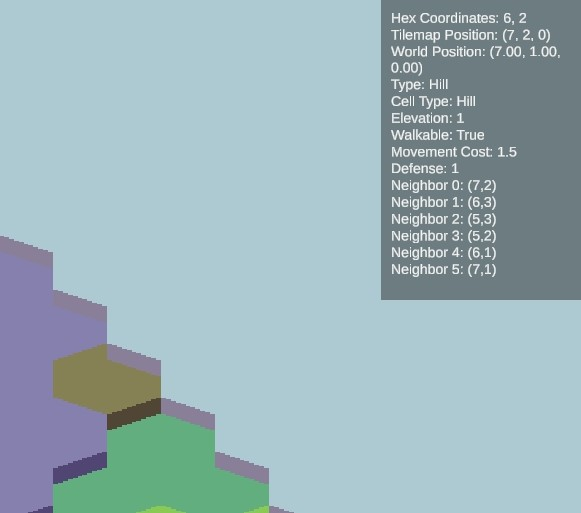{#fig:pic8 width="70%"}

The grid initialization process iterates through all tilemap positions, creating HexCell objects for occupied tiles and establishing neighbor relationships. Each cell maintains references to its six adjacent cells, for more efficient pathfinding calculations: the system uses these connections to build navigation graphs and calculate movement possibilities.

The player army is initially limited in movement by a fog of war that is visually represented as another tilemap rendered on top of the existing terrain \[[5.2](#fig:pic9){reference-type="ref" reference="fig:pic9"}\]. The game logic side of the implementation tracks revealed cells for each army using HashSet collections. Armies reveal cells within their vision range, typically three hex tiles in all directions. The pathfinding system restricts movement to revealed cells, preventing armies from navigating through unexplored territory.

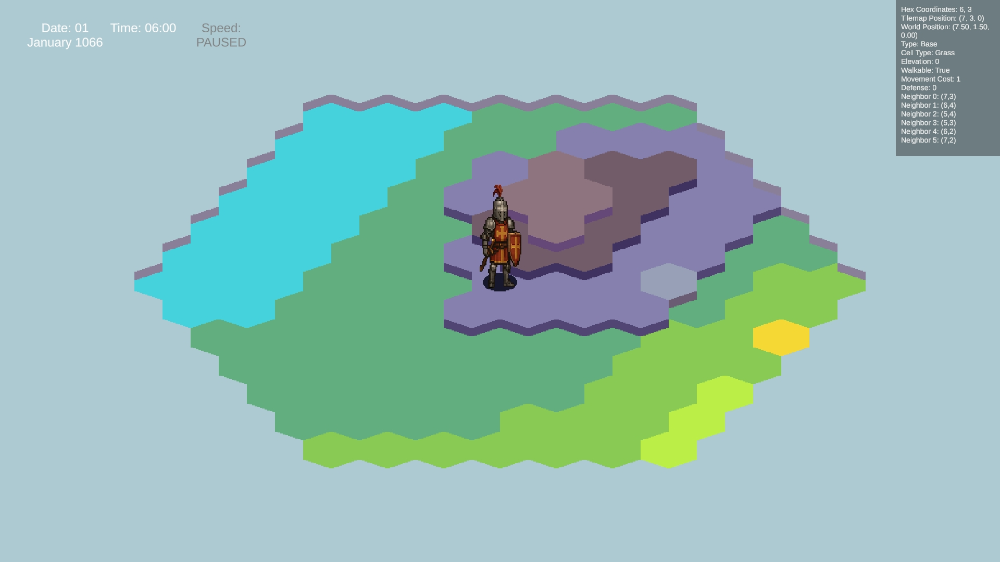{#fig:pic9 width="100%"}

## Army Organization and Soldier Simulation

The army structure follows a three-tier hierarchy: Army contains Units, which contain individual Troops. This type of troop organization is a compromise from a historical realism perspective when considering large scale, expansive battles that may have taken place over several days, but for the reduced scale of armies and combat the game tries to replicate, this is both a facile solution from a gameplay perspective and something not that different to how skirmishes with only a several dozen of troops would have took place. In this way, the army system has better aggregation of data about troops, more efficient data management and army management is kept simple enough to not distract the player. Each army maintains collections of units organized by troop type, also facilitating tactical categorization during battles \[[5.3](#fig:pic10){reference-type="ref" reference="fig:pic10"}\].

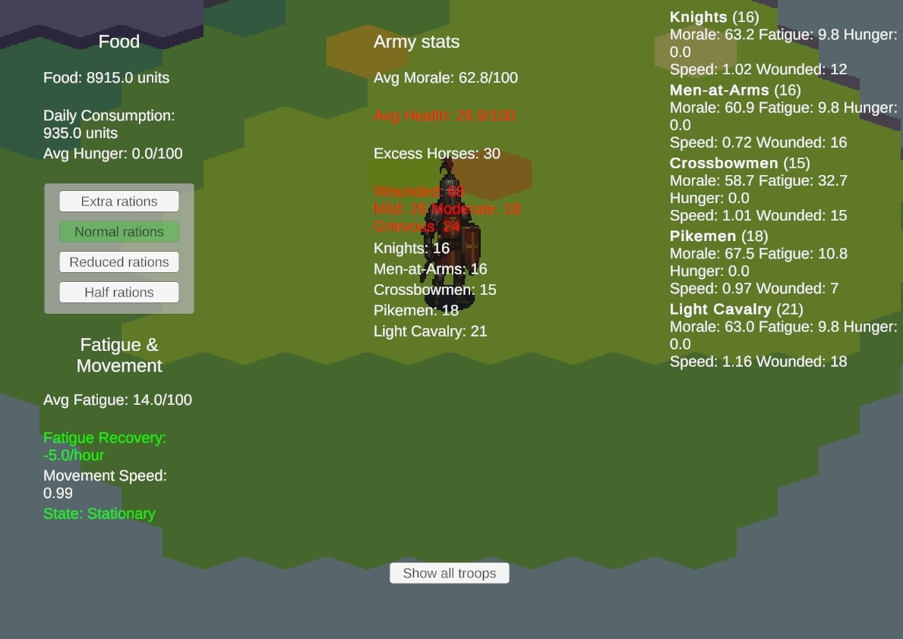{#fig:pic10 width="90%"}

Individual soldiers exist as Troop instances with extensive attribute sets \[[5.5](#fig:pic11){reference-type="ref" reference="fig:pic11"}\]. The initialization process generates procedural names from predefined lists and assigns base statistics according to troop type. Elite units like knights receive superior combat traits but require horses and consume more food. The system tracks 54 attributes per soldier which can roughly be separated in the following categories: Identity (Soldier's name, their type, their parent unit and their status which takes one of the following values Active/Deserted/Dead), Horse Management (characteristics that answer to the questions of does the troop require a horse to fulfill their role, does it have one regardless and how does having a horse help it), Health, Death, Morale, Desertion, Fatigue, Hunger, Experience and Rank, Combat, and Personal traits (Personality traits that are randomly assigned to the troop when it is initialized)

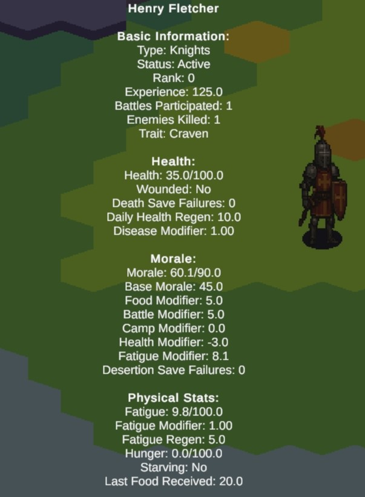{#fig:pic22 width="50%"}

Physical condition modeling takes values between 0 and 100 for most attributes, while modifiers are multiplied to base values. The daily update cycle processes health changes based on the following formulas:

Initial healthDamage is calculated based on wound severity and can take values between 2 and 5 \[[5.5](#fig:pic11){reference-type="ref" reference="fig:pic11"}\].

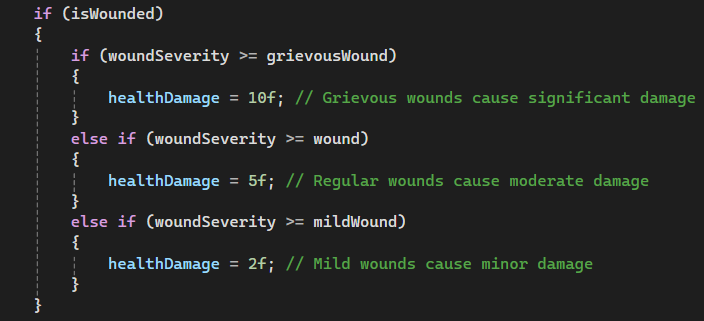{#fig:pic11 width="70%"}

A check is then made if the soldier is starving. Starving soldiers gain extra damage and do not recover health. Properly fed troops gain health based on all factors that contribute to their physical state \[[5.6](#fig:pic12){reference-type="ref" reference="fig:pic12"}\].

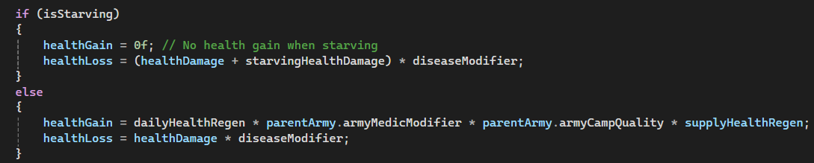{#fig:pic12 width="100%"}

Another check is made if the soldier has a relevant personality trait \[[5.7](#fig:pic13){reference-type="ref" reference="fig:pic13"}\].

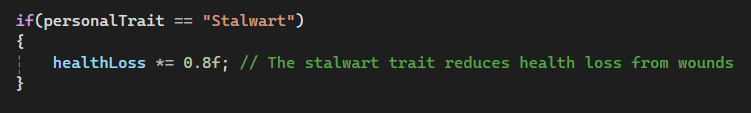{#fig:pic13 width="90%"}

Wounded soldiers lose health proportional to wound severity unless receiving adequate rest and supplies. Starvation causes 5 health damage per day, while proper nutrition gives a recovery of 10 health points, modified by medical care quality and camp conditions.

If the soldier had the time to properly heal and his health has gotten better past a threshold, he can then lose his wound and continue healing. \[[5.8](#fig:pic14){reference-type="ref" reference="fig:pic14"}\]

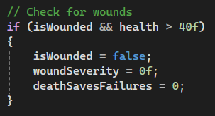{#fig:pic14 width="40%"}

If their health has gotten to a critical point, a saving check is done to see if they will survive to live another day, with their chances to survive decreasing for each passed check. If the soldiers health keeps degrading and does not get better, after 3 failed checks, they will succumb to their wounds \[[5.9](#fig:pic15){reference-type="ref" reference="fig:pic15"}\] \[[5.10](#fig:pic16){reference-type="ref" reference="fig:pic16"}\].

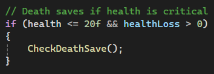{#fig:pic15 width="45%"}

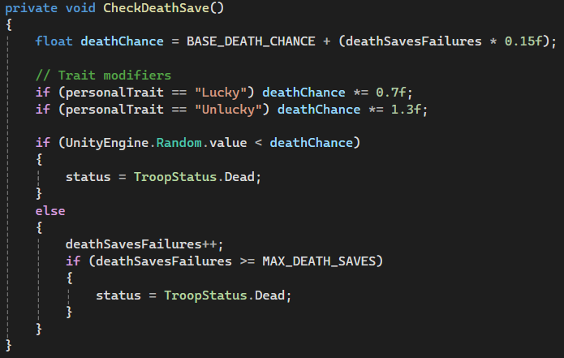{#fig:pic16 width="80%"}

The morale system works in a similar way to the health system to determine a soldier's psychological state. Five modifiers are calculated based on their general health, fatigue, if they are well fed or not, if their army has won more battles than it lost, and on their camp quality. These modifiers can take both positive and negative values and for the final value they are all added together to the previous value of the morale. As is the case for the health system, if morale gets too low, a desertion check is made and if the troop has failed it 3 times, then they will desert \[[5.11](#fig:pic17){reference-type="ref" reference="fig:pic17"}\].

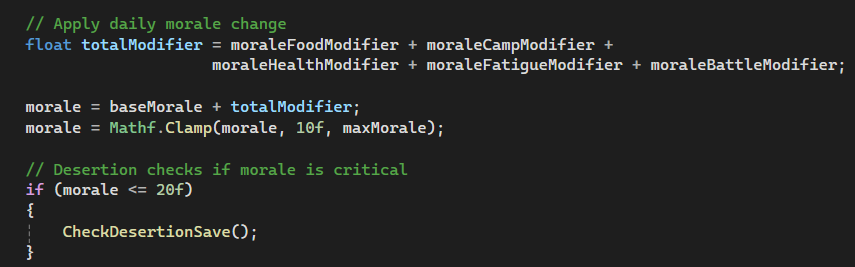{#fig:pic17 width="90%"}

The desertion chance is also modified by personality traits and by the veterancy of the troop \[[5.12](#fig:pic18){reference-type="ref" reference="fig:pic18"}\].

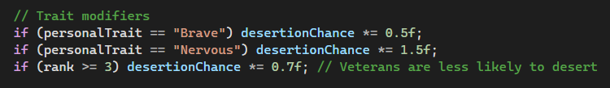{#fig:pic18 width="90%"}

## Movement and Pathfinding

The Army movement system utilizes the A\* pathfinding algorithm adapted for hexagonal grids. The implementation maintains open and closed sets of cells, tracking the lowest-cost path from start to goal. The heuristic function calculates Manhattan distance in hexagonal coordinates(sursa de unde am luat algoritmii astia):

Movement time calculations incorporate terrain costs and army conditions. The base movement time equals 60 minutes multiplied by the target cell's movement cost. This base time is then modified by the army's average movement speed, which aggregates individual soldier speeds. Wounded soldiers move at 80% speed, while severe fatigue above 70% applies another 20% penalty. Mounted infantry receive 50% speed bonuses, creating strategic value for maintaining horse supplies.

The movement system separates logical progression from visual representation. When initiating movement, the system calculates arrival time based on current game time plus movement duration. The army's state changes to \"Marching,\" triggering hourly fatigue accumulation for all soldiers. Upon reaching the scheduled arrival time, visual movement begins over 0.5 seconds using Unity's interpolation system. The visual movement is short enough to not cause any noticeable delays and to provide a smooth transition between cells for the player.

Movement restrictions prevent exhausted armies from continuing when average fatigue exceeds 90%. This specific implementation of the fatigue and rest mechanics reflects the historical realities of medieval military campaigns, where armies could not sustain continuous marching without significant performance degradation [@book3] [@book4]. The fatigue system accumulates 5 points per hour while marching, modified by terrain difficulty. Stationary armies recover fatigue at the same rate, giving the player the choice between pushing his troops for a couple more map tiles or trying to preserve their combat effectiveness for future battles.

## Supply and Logistics Management

The supply system\[[5.13](#fig:pic19){reference-type="ref" reference="fig:pic19"}\] models food distribution through daily allocation cycles. Each soldier requires base food amounts varying by troop type, from 5 units for basic infantry to 20 units for knights and siege engineers, a variance that comes from historical sources that mention the non-combat entourage of troops during the medieval ages that would also be consuming food supplies [@book6]. Supply level policies modify these requirements: half rations multiply by 0.6, reduced rations by 0.8, normal rations by 1.0, and extra rations by 1.2.

Food distribution prioritizes troops hierarchically when supplies prove insufficient. The algorithm sorts soldiers by troop type value and rank, allocating full rations to elite units first. Distribution continues down the hierarchy until food supplies exhaust, leaving lower-priority troops with partial or no rations. In order to leave more agency to the player regarding how the logistics of its army take place, the quantity of supply that is consumed daily can be changed from the user interface: lowering supply consumption means lowering the combat performance of the troops, while increasing it over the default threshold means troops will be more capable to fight, a morale boost strategy that is still done in the present day in armies before facing combat.

Supply level changes require two-day adjustment periods, preventing rapid policy shifts that could be used in order to exploit the combat effectiveness modifiers before battles. During transitions, the system tracks both current and pending supply levels, distributing food according to pending levels while combat calculations use current levels. In addition to the gameplay balancing reason for the adjustment period, this mechanic also tries to reflect how adjusting from subsistence rations to full meals would take some time to adjust.

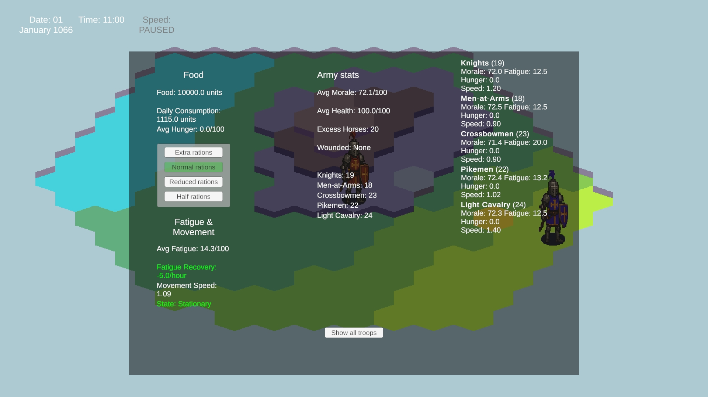{#fig:pic19 width="90%"}

The hunger system tracks individual troop satisfaction by comparing the amount of food received against expected rations. Soldiers receiving less than 50% expected food gain 20 hunger points daily, while well-fed troops lose 20 hunger points. Hunger exceeding 40 points triggers starvation status, causing daily health damage and severe morale penalties. Prolonged starvation leads to desertion or death, creating cascading failures in poorly supplied armies.

## Battle System

Battle initiation occurs when armies belonging to factions that are at war occupy identical hex cells during time updates. The system creates a Battle instance containing one BattleArmy wrapper for each army that extracts combat-capable soldiers while excluding wounded troops. After participating in multiple battles the player must choose if they will wait out for his troops to recover or go forward with the available troops.

The tactics system offers players multiple combat approaches based on army composition. Available tactics depend on present troop types: armies require skirmishers for harassment tactics, cavalry for charges, or infantry for defensive formations. Each tactic defines behavior patterns for different troop categories through attack intensity, defensive modifiers, and targeting priorities:

- **Hold** represents the default defensive posture where all troops maintain position without engaging. Infantry, cavalry, and skirmishers all receive zero attack intensity, meaning no troops actively seek combat. This tactic serves as a baseline option when players need time to assess battlefield conditions or when waiting for enemy forces to exhaust themselves. Despite its passive nature, troops still defend themselves during counter-attacks.

- **All-Out Attack** commits every available soldier to aggressive combat. All troop categories receive 1.0 attack intensity, meaning all combat-capable soldiers engage enemies each exchange. This level of aggression comes with a 1.2x incoming damage modifier, modeling the vulnerability created by abandoning defensive formations.

- **Defensive Line** emphasizes protection over aggression. Infantry troops take defensive positions and have zero attack intensity but receive only 0.6x incoming damage due to their stance. Cavalry support the line defensively, taking 0.7x damage and dealing 0.8x damage, while skirmishers provide limited harassment at 0.3x attack intensity from protected positions.

- **Skirmish Focus** dedicates the army to ranged harassment while keeping melee forces in reserve. Skirmishers operate at full attack intensity, launching volleys of arrows or bolts at enemy formations. Infantry and cavalry hold positions with zero attack intensity and no other modifiers.

- **Infantry Assault** is an attack tactic that uses mainly the available footmen. Infantry charge at full intensity while cavalry provides limited support at 0.3x intensity, skirmishers contribute harassment fire at 0.5x intensity, chipping away at the enemy before the main infantry attack.

- **Cavalry Charge** maximizes the shock value of mounted troops. Cavalry attack at full intensity with a 1.2x damage modifier. Infantry follow up at 0.5x intensity to exploit breakthroughs, while skirmishers provide light support at 0.3x intensity.

- **Shield Wall** creates nearly impenetrable defensive formations. Infantry adopt tight formations with only 0.2x attack intensity but receive just 0.4x incoming damage - the strongest defensive modifier available. This extreme protection comes at the cost of mobility and offensive capability. Cavalry provide strictly defensive support and skirmishers maintain 0.5x intensity harassment from behind the shield line.

- **Hammer and Anvil** is the most complex combined arms tactic, available to armies which have a complete set of troops of all types. Infantry serve as the \"anvil\" with 0.3 attack intensity and 0.7x damage taken. Cavalry act as the \"hammer\" with 0.8x intensity and a 1.1x damage dealt modifier. Skirmishers attack with an intensity of 0.6x intensity. This tactic requires both infantry and cavalry components but is versatile to compensate for the lack of availability.

- **Feinted Retreat** is a tactic designed to lure in the enemy. Infantry appear to retreat while maintaining 0.4x attack intensity through skirmishing withdrawals and taking 0.8x damage as they trade space for enemy overextension. Cavalry wait in reserve at zero intensity and Skirmishers keep 0.8x intensity fire.

- **Skirmish and Retreat** combines harassment with planned withdrawal. Skirmishers unleash attacks at 0.7x intensity while infantry and cavalry prepare retreat movements. All troops enter retreating preparation status, reducing their attack capabilities to 0.5x normal damage.

- **Ordered Retreat** executes systematic withdrawal while maintaining combat effectiveness. All troop types begin retreating movements while skirmishers provide covering fire at 0.5x intensity with 0.8x damage output. Infantry and cavalry take 0.8x incoming damage during withdrawal, reflecting their vulnerable state.

- **Full Retreat** represents complete battlefield abandonment. All troops immediately begin retreat procedures with minimal combat capability - only 0.3x damage output if forced to fight. The desperation of full flight increases incoming damage to 1.2x as troops abandon formation and equipment.

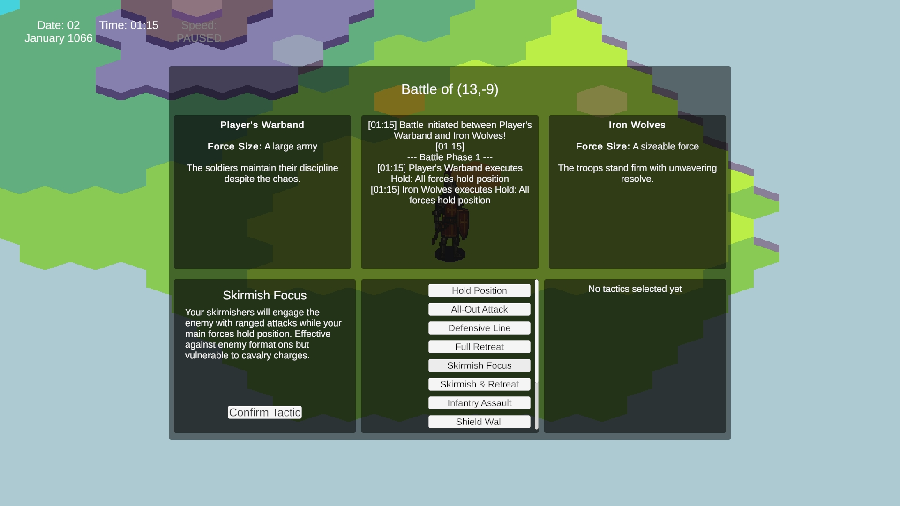{#fig:pic20 width="90%"}

Combat resolution processes through phases occurring every 30 game minutes. Each phase executes three tactical exchanges where both armies apply their selected tactics \[[5.14](#fig:pic20){reference-type="ref" reference="fig:pic20"}\] \[[5.15](#fig:pic21){reference-type="ref" reference="fig:pic21"}\] in sequence, with the first army to apply its tactic being the one that initiated the battle. Initiating a battle can give you an edge by having your troops apply the first round of damage, while being on the defensive side means you can counter attack and deploy tactics that better help your troops react to enemy army formations. The system determines the number of attacking troops for each combat phase sequence based on intensity values, selects targets according to tactical priorities, and resolves individual combats using soldier stats and modifiers.

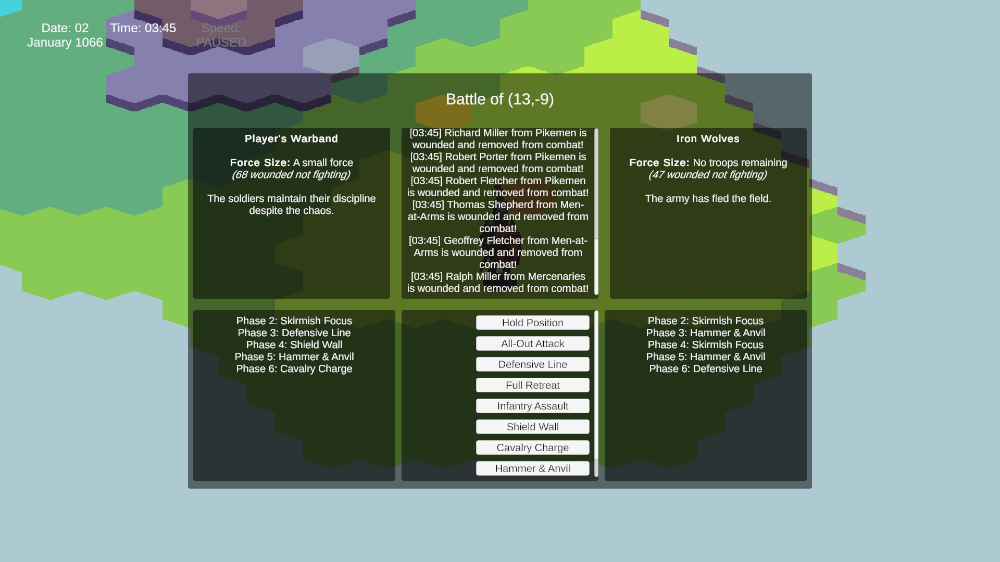{#fig:pic21 width="90%"}

Damage calculations incorporate multiple factors. Each troop type has two attack types, soft for targets that are more lightly armored and hard for targets whose armor needs to be pierced. Armor reduces soft damage by its percentage value while providing half of this reduction against hard damage.

::: {#tab:troop-stats}
**Troop Type** **Armor** **Defense** **Soft Attack** **Hard Attack** **Movement Speed**

---

Peasant Levy 5 2 30 10 1.0
Spearmen 20 4 40 20 0.8
Pikemen 25 6 50 40 0.7
Archers 10 2 50 25 0.9
Crossbowmen 15 4 45 45 0.9
Light Cavalry 20 6 60 20 1.4
Men-at-Arms 40 8 50 35 0.9
Knights 60 10 50 45 1.2
Mercenaries 40 8 45 30 0.9
Siege Engineers 10 2 5 60 0.5

: Troop Type Combat Statistics
:::

The base attack type is chosen by the system in order to maximize damage output. After the attack type is chosen, combat effectiveness and tactical modifiers are applied to the dealt damage. Defense values subtract directly from final damage with a minimum of 5 damage ensuring combat progression. The formula for total damage becomes:

$$
\begin{aligned}
D_{soft} &= A_{soft} \cdot (1 - p_{armor}) \\
D_{hard} &= A_{hard} \cdot (1 - 0.5 p_{armor}) \\
D_{f} &= \max(D_{soft}, D_{hard}) \cdot M_{combat} \cdot M_{tactic} \\
D_{total} &= \max(5, D_{f} - Def) \cdot M_{def}
\end{aligned}
$$

where: $$\begin{aligned}
A_{soft} &= SoftAttack \\
A_{hard} &= HardAttack \\
p_{armor} &= ArmorPercent \\
M_{combat} &= CombatEffectiveness Modifier \\
M_{tactic} &= TacticalModifier \\
Def &= Defense \\
M_{def} &= DefenderTacticDamageModifier \\
\end{aligned}$$

Combat effectiveness aggregates soldier condition factors. Wounds reduce effectiveness proportionally to severity, with 60% severity creating 40% effectiveness. Morale below 30 applies a 0.8 multiplier, while high morale above 70 provides a 1.2 multiplier. Fatigue and hunger reduce effectiveness by up to 20% at maximum values. Rank bonuses add 10% per level and unit cohesion modifiers range from 0.8 to 1.2 depending on veteran presence.

The morale system during combat tracks battle-specific values separate from base campaign map morale, an attempt to mirror historical understanding of how battlefield psychology differs from general army morale [@study7] [@study8]. Casualties reduce army morale proportionally to loss percentages, with individual soldiers losing morale when taking damage or witnessing nearby deaths. Armies with average morale below 20 trigger mass routing, effectively ending their combat participation.

During battles, participating troops receive experience for the following events:

- Surviving each combat phase (5 XP points)

- Surviving the battle (25 XP points)

- Winning the battle (15 XP points)

- Killing an enemy soldier after dealing more than enough damage to bypass the wounds system and get the enemy soldier below 0 health (50 XP points)

After the battle is finished, this XP is carried over to the troop stats from the campaign army and the troop can level up if enough XP was accumulated.

## Enemy AI

Enemy armies operate through modular AI components that evaluate situations and make decisions independently. The decision-making cycle runs every three game hours, checking movement possibilities and selecting actions based on weighted probabilities. The system uses a probability of 0.7 for movement actions and 0.3 for resting, with future expansion possible for additional behaviors.

Movement decisions evaluate walkable neighbors within vision range, filtering options based on territorial constraints. Enemy armies have a spawn point hex cell and strictly patrol on a radius around it, typically three hexes, preventing wandering and potential soft locks if the player cannot reach them. When approaching territorial limits, the AI prioritizes moves toward spawn locations. The path selection uses random choices among valid options. Campaign map enemy AI also monitors army conditions and adjusts behavior accordingly. Armies with average fatigue above 80% enter rest modes regardless of movement probabilities.

Combat AI selects tactics based on army composition and condition analysis. Low morale below 30% triggers retreat tactics, with a preference for retreat tactics that protect troops. Armies with strong cavalry components favor charge tactics when morale exceeds 60%. Skirmisher-heavy forces prefer harassment tactics while maintaining defensive positions. The AI avoids the basic \"Hold\" tactic unless no other options remain available.

## Event System

The event system provides random encounters when the player army enters hex cells containing specific tile sprites. The EventTileManager singleton monitors player movement and triggers events based on the underlying tilemap data.

When the player moves to a new hex cell, the system checks the tile sprite at that position against a predefined set of event tiles. A HashSet tracks visited positions to prevent the repeated triggering of one-time events. When an event activates, the game pauses and displays a modal interface with event text and effects.

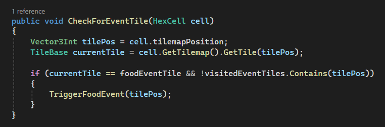{#fig:pic22 width="90%"}

Four one-time events provide permanent benefits. The food event adds 5000 food units to army supplies. The camp quality event increases either the army's medical modifier or camp quality modifier by 0.1, with each improvement type limited by the number of hex tiles assigned to that event. The fog of war event permanently increases vision range by three hexes. The reinforcement event adds 5-10 soldiers of a specified type to the player's army.

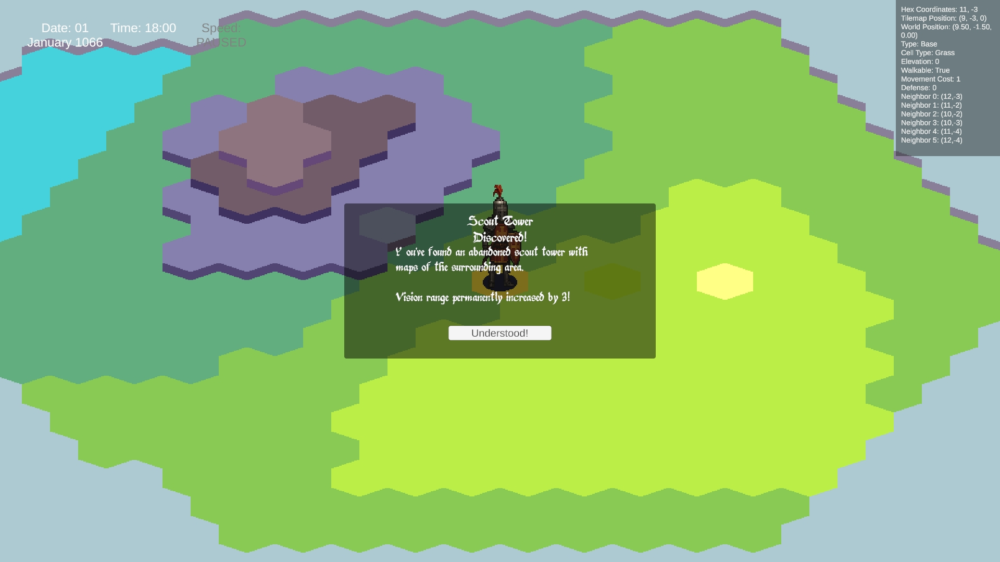{#fig:pic22 width="90%"}

The horse event operates differently, triggering with a 5% probability at any location with a seven-day cooldown period. This event adds 10 horses to the army's supply, which the existing redistribution system automatically allocates to infantry units.

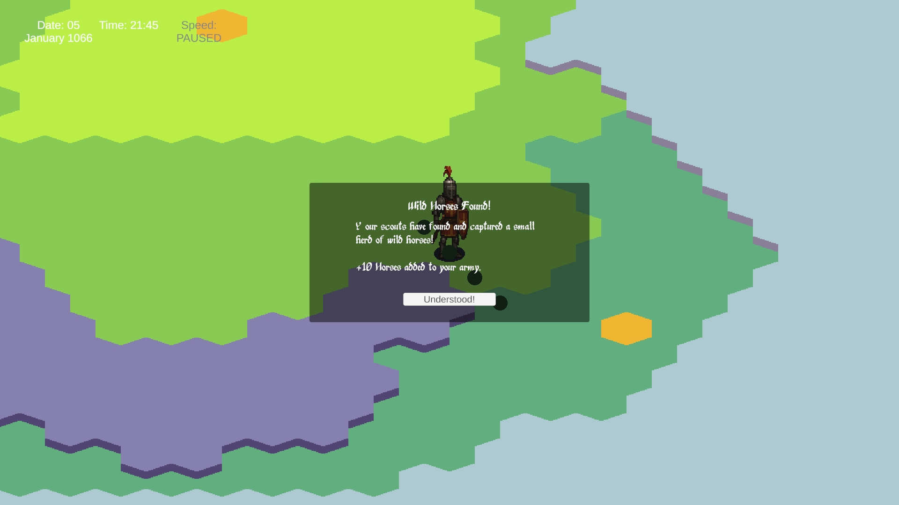{#fig:pic22 width="90%"}

The system uses Unity's tilemap comparison for event detection rather than collision detection. Event outcomes integrate directly with the existing army systems - food events call AddFood(), reinforcements use the standard unit creation process, and the horse event triggers the established redistribution logic. The modal UI uses TextMeshPro components and automatically resumes game time after player acknowledgment.

## Game Engine

The project utilizes Unity 2022.3 LTS as its game engine, chosen for its ease of use and integrated 2D tilemap system. Unity's component-based architecture also aligns well with the modular design of the game: armies, units, and individual soldiers exist as discrete entities with attached behaviors.

The game makes use of Unity's GameObject hierarchy to organize game entities. Each army exists as a GameObject with multiple components: movement controllers, army data containers, and visual representations through SpriteRenderer components. This separation of concerns allows for independent updating of visual position, logical position, and army state and facilitates development by simplifying processes.

Unity's event system helps with communication between the decoupled systems. The OnMovementStateChanged event notifies UI components when armies transition between marching and stationary states. Battle events trigger UI updates and pause the game when player armies engage.

This implementation allows the battle manager to operate independently of specific UI implementations and still provide necessary notifications for player feedback.

# Evaluation

In this chapter an evaluation of the implementation against the defined functional requirements is made, analyzing user feedback collected through testing, and identifying areas for improvement based on observed usage patterns.

## Functional Requirements Validation

- FR1: Individual Soldier Simulation System - The implementation successfully tracks 54 attributes per soldier including procedural names, personality traits, combat statistics, and personal history. The system records battle participation, kills, wounds, and experience progression through a five-tier rank system that affects combat effectiveness.

- FR2: Realistic Logistic Management - The food distribution system operates with four supply levels (half, reduced, normal, extra rations) that modify daily consumption rates. The system calculates daily consumption based on troop type requirements and implements hierarchical distribution prioritizing elite troops during shortages.

- FR3: Movement and Fatigue System - Movement states correctly track marching and stationary conditions with hourly fatigue accumulation. Movement speed calculations incorporate individual soldier conditions including fatigue, wounds, and horse equipment. The system prevents movement when average army fatigue exceeds 90%.

- FR4: Integrated Combat System - The tactical combat system implements 12 distinct tactics with differentiated behaviors for infantry, cavalry, and skirmisher categories. Combat performance calculations incorporate individual soldier status including fatigue, hunger and morale, across phase-based exchanges.

- FR5: Emergent Narrative Generation - The system tracks individual soldier progression through experience gain, rank advancement, kill counts, and battle survival. Veterans retain their combat history and statistical improvements throughout multiple engagements.

## User Feedback Analysis

Eight participants tested the game across different experience levels with strategy games and reported on the functionalities. The survey was done in Romanian in order to remove any barrier language the testers might have had.

The players' reported age and game preference are as follows:

<figure id="fig:pic23">

<a href="https://docs.google.com/forms/d/1m04NMAhn8hLmem1DedbmK3d9IEhBA68RxiJU2CYxmi8/edit#responses">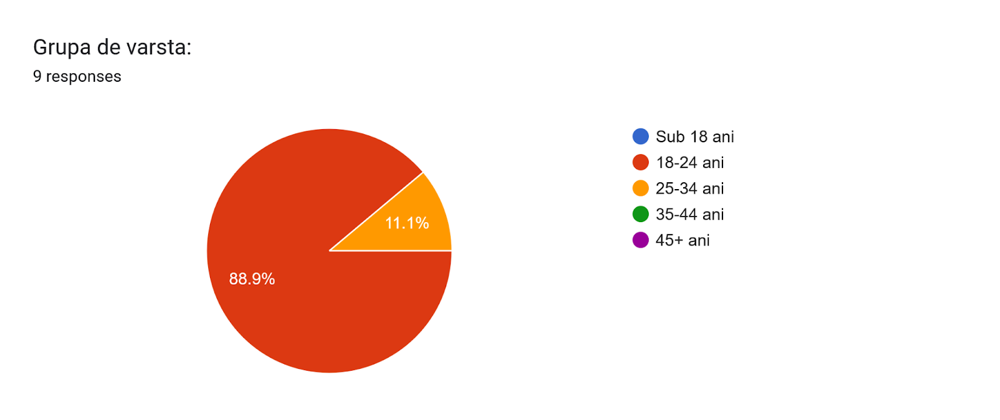</a>

<figcaption>Age distribution of game testers</figcaption>
</figure>

<figure id="fig:pic24">

<a href="https://docs.google.com/forms/d/1m04NMAhn8hLmem1DedbmK3d9IEhBA68RxiJU2CYxmi8/edit#responses">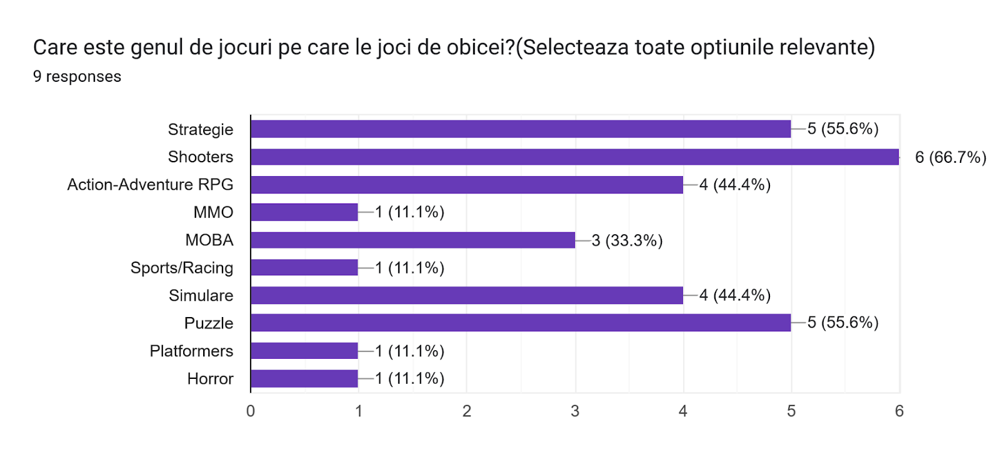</a>

<figcaption>Preferred game distribution</figcaption>
</figure>

The players were also asked about their experience with the genres of similar games, analyzed in [3](#chap:SimilarSolutions){reference-type="ref" reference="chap:SimilarSolutions"} and reported the following.

<figure id="fig:pic25">

<a href="https://docs.google.com/forms/d/1m04NMAhn8hLmem1DedbmK3d9IEhBA68RxiJU2CYxmi8/edit#responses">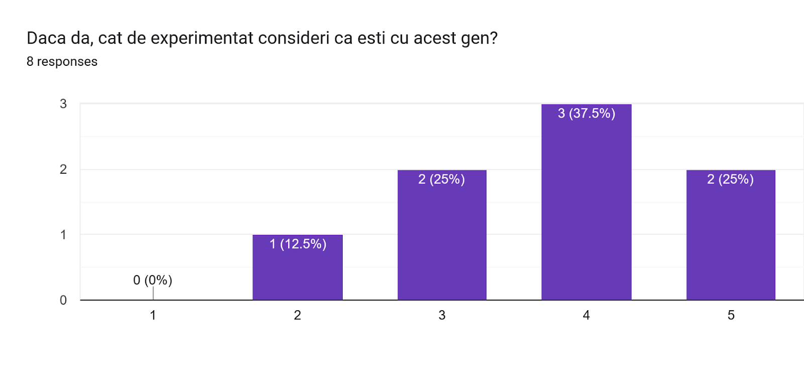</a>

<figcaption>Experience with strategy games</figcaption>
</figure>

<figure id="fig:pic26">

<a href="https://docs.google.com/forms/d/1m04NMAhn8hLmem1DedbmK3d9IEhBA68RxiJU2CYxmi8/edit#responses">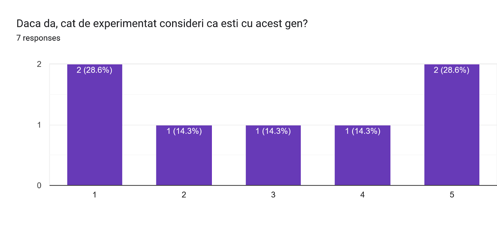</a>

<figcaption>Experience with grand strategy games</figcaption>
</figure>

<figure id="fig:pic27">

<a href="https://docs.google.com/forms/d/1m04NMAhn8hLmem1DedbmK3d9IEhBA68RxiJU2CYxmi8/edit#responses">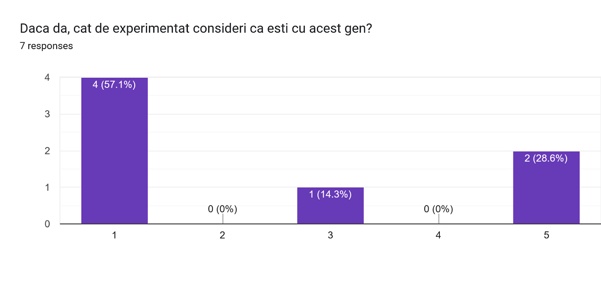</a>

<figcaption>Experience with colony management games</figcaption>
</figure>

The questions sent to the testers regarding game functions are aggregated in the following categories: interface usability, information access patterns, battle system reception and event system management. The player responses are further analyzed

- Interface Usability - UI intuitiveness received ratings between 2-5 with an average of 4. Six participants rated the interface as 4 or higher, indicating generally positive reception. Two participants reported difficulty understanding game mechanics without prior strategy game experience.

- Information Access Patterns - Player engagement with different information systems varied significantly. Army status monitoring occurred \"Very Frequently\" or \"Frequently\" for 50% of participants and \"Sometimes\" for another group representing 37.5%. Individual soldier information access was more limited, with 50% reporting \"Rarely\" or \"Didn't know it was possible\" interactions. Enemy army information checking showed moderate engagement levels, with responses split between \"Sometimes\" and \"Frequently\".

- Battle System Reception - Battle difficulty ratings averaged 3.0 on a 5-point scale. Battle interface intuitiveness scored a 3.38 average, with ratings ranging from 1-5. Individual soldier statistics interest averaged at 3.75, suggesting moderate player engagement with the detailed simulation aspects.

- Event System Engagement - Event tile interaction frequency showed 62.5% of players engaging \"Frequently\" or \"Very Frequently\" with special events, indicating successful integration of the random encounter system.

## Technical Issues Identified

Several technical problems appeared during testing. The supply level change system caused confusion about the interface when the two-day adjustment period blocked immediate changes. The players attempted to modify rations multiple times without understanding the time restriction, interpreting this as a bug.

Visual feedback for tile selection and movement requires improvement. Players reported difficulty identifying clickable tiles and understanding terrain differences.

Tutorial and onboarding systems were completely absent. Players unfamiliar with strategy games struggled to understand the basic mechanics, including time controls, army management interfaces, and combat resolution processes. Multiple participants requested explanatory interfaces for game systems.

## Future Developments

Based on received feedback, the following changes will be made to the game

- A comprehensive tutorial system will be implemented, with the purpose of explaining the time controls, army management, and combat mechanics. Tooltips and explanatory text will be added for all interface elements. Clear visual feedback will be provided for supply level change timers and restrictions.

- Contextual help systems, explaining statistical interactions and combat effectiveness, will be created. Progressive disclosure techniques will be used to reduce information overload for new players.

- Tile selection visuals will be improved upon, with clear borders and hover effects. Audio cues will be added for important events and state changes.

- AI faction interactions will be expanded upon, beyond only territorial patrolling. A diplomatic system that will allow temporary alliances or conflict between AI factions will be created.

- Victory conditions beyond enemy elimination will be created, to provide varied strategic objectives and more ways to approach the game.

# Conclusions

The project managed to achieve its set objectives. The proposed solution tracks 54 attributes per soldier, including physical condition, psychological state, and combat history, proving the technical feasibility of managing the statistical information of hundreds of individual characters simultaneously.

The hierarchical army organization system effectively balances detail with usability, allowing players to manage their army while preserving individual soldier stories. The logistics and movement systems create purposeful strategic decisions where food distribution, march routes, and rest periods directly affect combat performance through individual soldier conditions.

The battle system demonstrates how individual soldier attributes influence combat outcomes. Exhausted, hungry, or demoralized troops perform poorly regardless of troop type or number advantages, creating realistic tactical scenarios where army condition matters as much as composition. The twelve distinct battle tactics provide strategic depth while remaining accessible to players.

Performance testing validates the technical approach, maintaining 60 FPS with armies of 100-150 soldiers on standard consumer hardware. The modular architecture allows expansion to larger army sizes without fundamental changes to the core systems.

User testing revealed both strengths and areas for improvement. Players engaged positively with the army management systems and event encounters, but struggled with interface complexity and the absence of tutorial systems. The detailed individual soldier simulation appealed to experienced strategy players but proved overwhelming for newcomers without proper guidance.

Future development will focus on improving user onboarding through comprehensive tutorial systems and enhanced visual feedback. The core simulation architecture provides a solid foundation for expansion into larger campaigns, diplomatic systems, and more complex strategic objectives.
